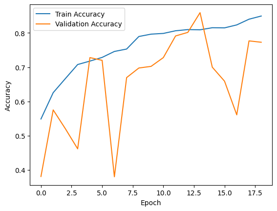
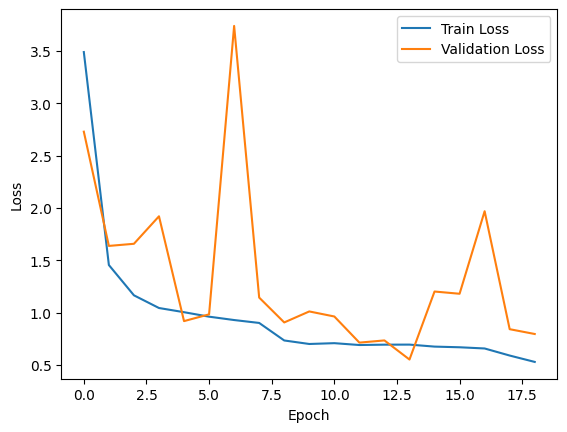

# 📸 Deepfake Classification Challenge

## 🔍 Overview

This project explores multiple machine learning approaches to solve an image classification task. The goal was to compare traditional models with deep learning architectures and optimize performance through preprocessing, feature extraction, and hyperparameter tuning.

---

## 🚀 Approaches Implemented

### 1. 🔧 Fine-tuning a Pretrained Model

- Used a pretrained deep learning model and fine-tuned it on our dataset.
- Achieved **80.13%** accuracy on the validation set.

### 2. ⚙️ Support Vector Machine (SVM)

- Tested both linear and RBF kernels.
- Linear kernel accuracy: **43.33%**
- RBF kernel accuracy (with hyperparameter tuning): **64%**
- Used color histograms as feature input.

### 3. 👥 K-Nearest Neighbors (K-NN)

- Tested various values of K with Euclidean distance.
- Best accuracy: **30.93%**
- Used color histograms as feature input.

### 4. 🧠 Convolutional Neural Networks (CNN)

- Basic CNN model reached **80.2%** accuracy.
- Optimized CNN model (improved augmentation and architecture) achieved **85.4%** accuracy.
  
  

---

## 🧹 Data Preprocessing & Feature Extraction

- Images normalized to [0,1].
- Data augmentation applied for CNN models (random rotations, flips, zoom, shifts).
- Extracted color histograms for classical models (SVM, K-NN).

---

## ⚙️ Hyperparameter Tuning

- **SVM**: Grid search on C and gamma for RBF kernel.
- **CNN**: Tuning learning rate, batch size, number of layers, dropout rate, and augmentation parameters.

| Model         | Hyperparameters                      | Accuracy |
| ------------- | ------------------------------------ | -------- |
| SVM (RBF)     | C=10, gamma=0.01                     | 64%      |
| SVM (Linear)  | Default                              | 43.33%   |
| CNN Basic     | LR=0.001, Batch size=32              | 80.2%    |
| CNN Optimized | LR=0.0001, Dropout=0.3, Augmentation | 85.4%    |

---

## 📊 Results

- CNN models significantly outperformed classical models.
- Optimized CNN showed the best overall performance.
- Confusion matrices show reduced misclassification for CNN models.

---

## 📁 Files Included

- Python scripts implementing all models (fine-tuning, SVM, K-NN, CNN).
- Data preprocessing and augmentation scripts.
- Diagrams illustrating CNN architectures and training curves.
- This README and the project report (`Agusoaei_Alexandru_233_doc.PDF`).
